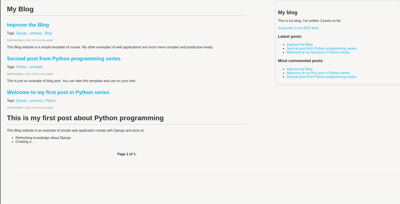

## This is an example of simple Django application



### Features

The following features were implemented:

- Admin panel for post adding, editing, deletion
- Comments
- Post sharing via e-mail
- Post recommendation
- Search (`http://127.0.0.1:8000/blog/search`)
- Tags
- Sitemap
- RSS

### Installation

```
$ git clone https://github.com/AlekseiMikhalev/django-blog.git
$ python -m venv .venv
$ poetry install
```

## Usage

```
$ python manage.py runserver
```